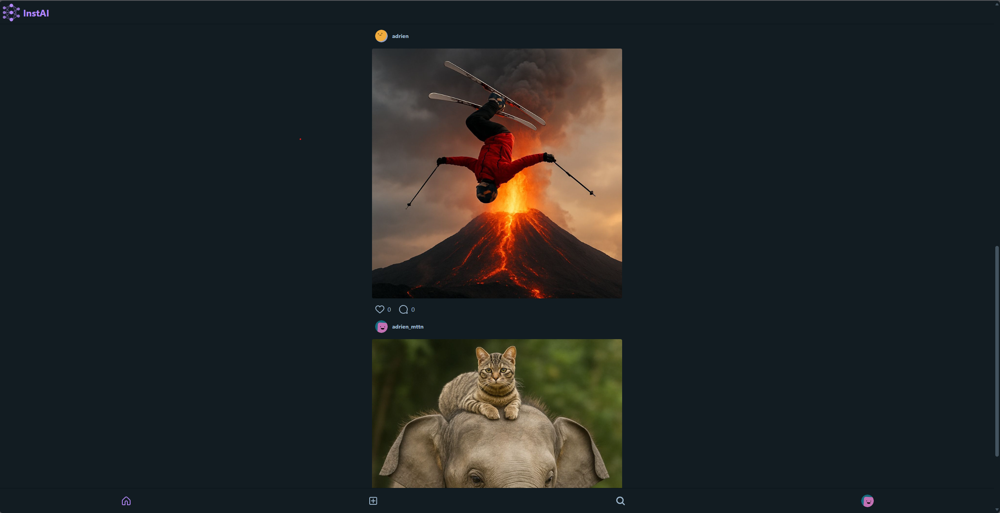
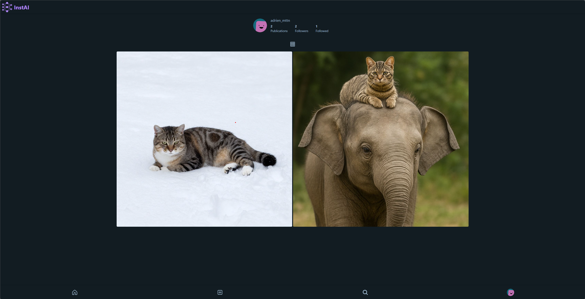

# 🎨 InstAI - Réseau Social d'Images Générées par IA

<div align="center">


_Un réseau social innovant où l'art de l'IA prend vie_ ✨

[🚀 Demo](https://adrikiwi.freeboxos.fr/instai/)

</div>

---

## 📋 Table des matières

- [🎨 InstAI - Réseau Social d'Images Générées par IA](#-instai---réseau-social-dimages-générées-par-ia)
  - [📋 Table des matières](#-table-des-matières)
  - [🎯 À propos](#-à-propos)
    - [🌟 Points forts](#-points-forts)
  - [✨ Fonctionnalités](#-fonctionnalités)
    - [Pour les utilisateurs](#pour-les-utilisateurs)
    - [Techniques](#techniques)
  - [🛠️ Technologies](#️-technologies)
    - [Frontend](#frontend)
    - [Backend](#backend)
    - [Services externes](#services-externes)
  - [🏗️ Architecture](#️-architecture)
  - [🎨 Captures d'écran](#-captures-décran)
  - [](#)
  - [🐛 Problèmes connus](#-problèmes-connus)
  - [📄 License](#-license)
  - [👥 Auteurs](#-auteurs)
  - [🙏 Remerciements](#-remerciements)

---

## 🎯 À propos

**InstAI** est une plateforme de réseau social moderne dédiée aux images générées par intelligence artificielle. Inspirée par Instagram, elle permet aux utilisateurs de créer, partager et découvrir des créations artistiques uniques générées par IA.

### 🌟 Points forts

- 🎨 **Génération d'images IA** : Créez des images uniques à partir de prompts textuels
- 🔄 **Fil d'actualité infini** : Découvrez en continu les créations de la communauté
- 💬 **Interactions sociales** : Likez, commentez et partagez vos créations favorites
- 👥 **Système de followers** : Suivez vos créateurs préférés
- 🔐 **Authentification OAuth** : Connexion sécurisée via GitHub ou Google

---

## ✨ Fonctionnalités

### Pour les utilisateurs

- ✅ **Authentification OAuth 2.0** (GitHub & Google)
- ✅ **Génération d'images IA** via l'API Pollination
- ✅ **Publication de créations** avec hébergement automatique
- ✅ **Fil d'actualité personnalisé** avec infinite scroll
- ✅ **Système de likes** sur les publications
- ✅ **Commentaires** et interactions
- ✅ **Profils utilisateurs** personnalisables
- ✅ **Système de follow/unfollow**
- ✅ **Recherche d'utilisateurs**

### Techniques

- 🎨 **Interface responsive** (mobile-first)
- ⚡ **Performance optimisée** avec Vue 3 Composition API
- 🎭 **Animations fluides** avec GSAP
- 🎯 **TypeScript** pour le frontend
- 🔒 **Sessions sécurisées** côté serveur
- 📦 **Architecture modulaire**

---

## 🛠️ Technologies

### Frontend

| Technologie                                   | Version | Description                     |
| --------------------------------------------- | ------- | ------------------------------- |
| [Vue.js](https://vuejs.org/)                  | 3.5.24  | Framework JavaScript progressif |
| [TypeScript](https://www.typescriptlang.org/) | 5.9.3   | Superset typé de JavaScript     |
| [Vue Router](https://router.vuejs.org/)       | 4.6.3   | Routage officiel pour Vue.js    |
| [Pinia](https://pinia.vuejs.org/)             | 3.0.4   | Store state management          |
| [TailwindCSS](https://tailwindcss.com/)       | 4.1.17  | Framework CSS utility-first     |
| [DaisyUI](https://daisyui.com/)               | 5.5.8   | Composants UI pour Tailwind     |
| [GSAP](https://greensock.com/gsap/)           | 3.13.0  | Animations professionnelles     |
| [Vite](https://vitejs.dev/)                   | 7.2.4   | Build tool ultra-rapide         |

### Backend

| Technologie                                             | Version | Description                   |
| ------------------------------------------------------- | ------- | ----------------------------- |
| [Node.js](https://nodejs.org/)                          | -       | Runtime JavaScript            |
| [Express.js](https://expressjs.com/)                    | 5.2.0   | Framework web minimaliste     |
| [MySQL](https://www.mysql.com/)                         | -       | Base de données relationnelle |
| [Passport.js](https://www.passportjs.org/)              | 0.7.0   | Authentification middleware   |
| [Express Session](https://github.com/expressjs/session) | 1.18.2  | Gestion des sessions          |

### Services externes

- **Pollination AI** : Génération d'images par IA
- **PostImg** : Hébergement d'images
- **GitHub OAuth** : Authentification
- **Google OAuth** : Authentification

---

## 🏗️ Architecture

```
InstAI/
├── backend/
│   ├── src/
│   │   ├── config/
│   │   │   └── bd.js              # Configuration MySQL
│   │   ├── controllers/
│   │   │   ├── image.controller.js    # Gestion images IA
│   │   │   ├── publication.controller.js
│   │   │   └── user.controller.js     # Gestion utilisateurs
│   │   ├── models/
│   │   │   └── user.js
│   │   └── index.js               # Point d'entrée Express
│   ├── .env
│   └── package.json
│
├── frontend/
│   ├── src/
│   │   ├── components/        # Composants réutilisables
│   │   │   ├── accueilComponent/
│   │   │   ├── profileComponent/
│   │   │   ├── publicationComponent/
│   │   │   ├── appHeader.vue
│   │   │   ├── navBar.vue
│   │   │   └── userComponent.vue
│   │   ├── models/            # Modèles TypeScript
│   │   │   ├── user.ts
│   │   │   ├── publications.ts
│   │   │   └── comment.ts
│   │   ├── routes/            # Configuration router
│   │   │   └── index.ts
│   │   ├── service/           # Services API
│   │   │   ├── userService.ts
│   │   │   └── publicationService.ts
│   │   ├── stores/            # Pinia stores
│   │   │   └── userStores.ts
│   │   ├── vue/               # Pages Vue
│   │   │   ├── accueil.vue
│   │   │   ├── create-publication.vue
│   │   │   ├── profile.vue
│   │   │   ├── publication.vue
│   │   │   ├── search-users.vue
│   │   │   ├── followers.vue
│   │   │   ├── followed.vue
│   │   │   ├── login.vue
│   │   │   └── create-account.vue
│   │   ├── App.vue
│   │   ├── main.ts
│   │   └── style.css
│   ├── vite.config.ts
│   ├── tsconfig.json
│   └── package.json
│
├── BDD/
│   └── bdd.sql                # Schéma de base de données
│
├── .gitignore
└── readme.md
```

## 🎨 Captures d'écran




## 🐛 Problèmes connus

- Les images générées peuvent prendre quelques secondes
- Limite de taux de l'API Pollination

---

## 📄 License

Ce projet est sous licence **MIT**. Voir le fichier `LICENSE` pour plus de détails.

---

## 👥 Auteurs

- **Adrien_mttn** - _Développeur principal_ - [@adrien_mttn](https://github.com/adrien_mttn)

---

## 🙏 Remerciements

- [Pollination AI](https://pollination.cloud/) pour l'API de génération d'images
- [PostImg](https://postimg.cc/) pour l'hébergement d'images
- La communauté Vue.js et Express.js
- Tous les contributeurs du projet

---

<div align="center">

**⭐ N'oubliez pas de star le projet si vous l'aimez ! ⭐**

Made with ❤️ and ☕

[⬆ Retour en haut](#-instai---réseau-social-dimages-générées-par-ia)

</div>
